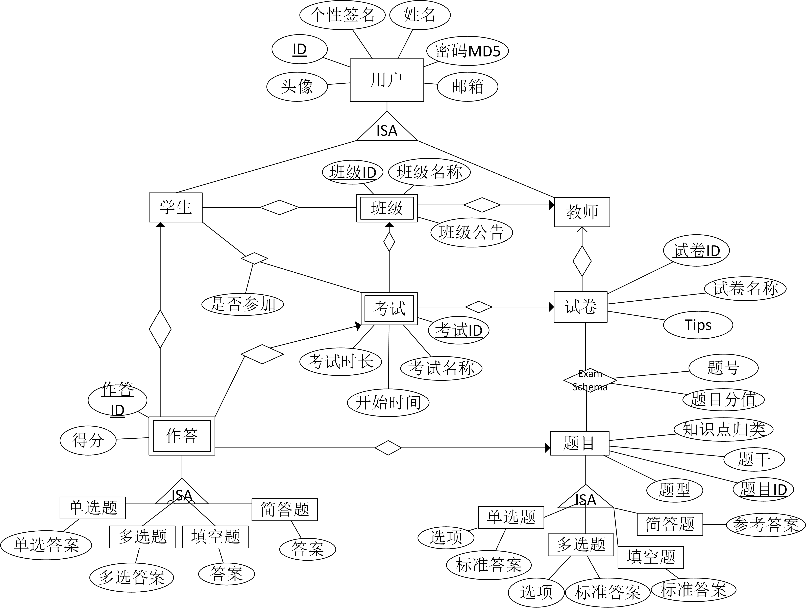
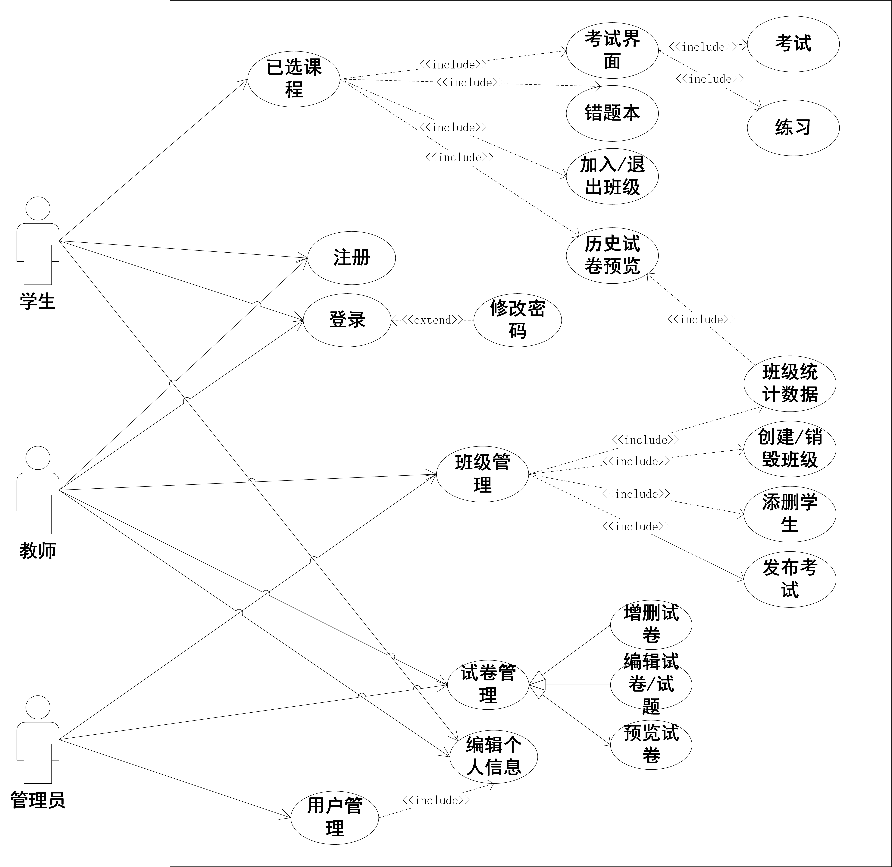
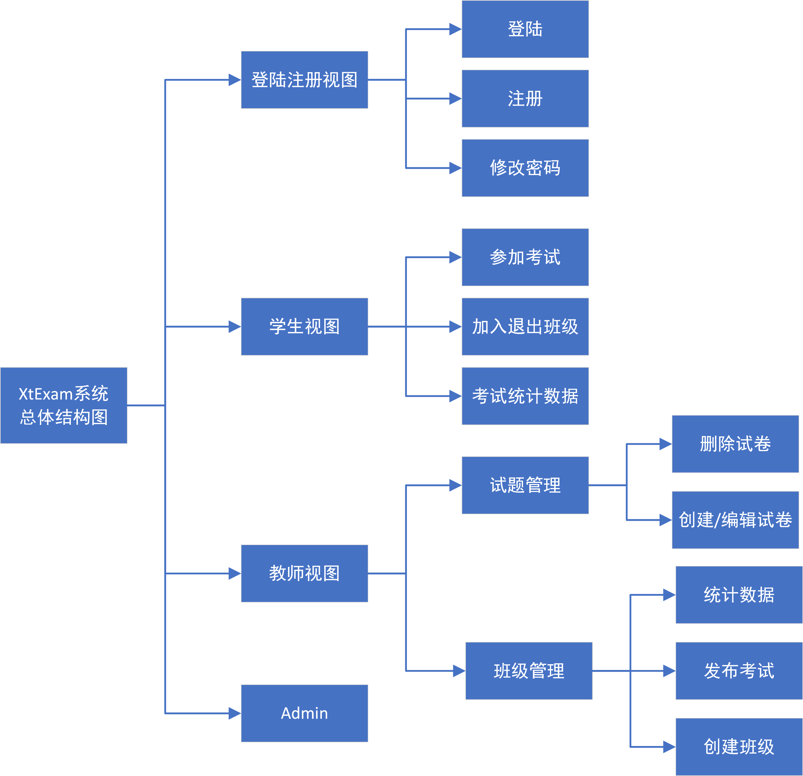

# XtExam - 学拓考试系统

## 项目简介

华侨大学软件工程基础课程作业 (2023/9-2023/12)

XtExam (学拓考试系统)是一个类似学习通的系统，是学习通的一个子集。我们设想的用户是大学里的教师与学生。教师可以为每门课程创建一个班级，然后在这个班级里创建试卷、发布考试任务、查看学生的作答并进行批改。学生可以加入班级、在班级里查看考试并进行作答。

前端：HTML+CSS+JavaScript

后端：Python Django

- Django是一个使用Python编写的开源Web应用程序框架。它提供了一系列工具和功能，帮助开发人员快速构建功能强大的Web应用程序。

数据库：SQLite

- SQLite是一种嵌入式关系型数据库管理系统，SQLite是零配置的，不需要单独的服务器进程，而是直接在应用程序中使用。非常适合小型项目或个人使用。

- SQLite是Django的默认数据库后端。

## 使用方法：

1. 配置邮箱，在`\mainsite\settings.py`中配置以下选项:

   ~~~py
   # 配置邮箱
   EMAIL_BACKEND = 'django.core.mail.backends.smtp.EmailBackend'
   EMAIL_USE_TLS = True  # 是否使用TLS安全传输协议(用于在两个通信应用程序之间提供保密性和数据完整性。)
   EMAIL_USE_SSL = False  # 是否使用SSL加密，qq企业邮箱要求使用
   EMAIL_HOST = 'smtp.126.com'  # 发送邮件的邮箱 的 SMTP服务器，这里用了163邮箱
   EMAIL_PORT = 25  # 发件箱的SMTP服务器端口
   EMAIL_HOST_USER = ''  # 发送邮件的邮箱地址
   EMAIL_HOST_PASSWORD = ''  # 发送邮件的邮箱密码(这里使用的是授权码)
   ~~~

2. 创建数据库迁移文件

   ~~~sh
   py mamage.py makemigrations
   ~~~

3. 应用数据库迁移文件，将数据库模式的更改实际应用到数据库中

   ~~~
   py mamage.py migrate
   ~~~

4. 运行服务器

   ~~~sh
   py manage.py runserver
   ~~~

## 代码结构说明

~~~sh
├─mainsite				# 由django-admin startproject生成的包
└─XtExam				# XtExam
    ├─migrations		# 数据库迁移文件
    ├─static			# 静态文件
    │  ├─css			# 存储所有的CSS
    │  ├─img			# 存储图片
    │  └─js				# 存储所有的JavaScript
    ├─templates			# 存储所有的HTML模板
    ├─views				# 存储所有页面的视图函数
~~~

## 数据库设计

数据库 E-R图

 

关系模式：

~~~md
用户(ID, 类型, 个性签名, 姓名, 头像存储地址, 密码的MD5, 邮箱)
User(user_id, type, motto, name, avatar_addr, psd, mail)

学生和班级的关系(学生ID, 班级ID)
MembersOf(user_id(type=stu), class_id)

班级(班级ID, 班级名称, 教师ID, 班级公告)
Class(class_id, class_name, user_id(type=tea), bulletin)

考题(考题ID, 分值, 考题类型, 知识点类型, 题干, 选项, 标准答案)
Question(ques_id, ques_type, ques_category, ques_prompt, options, standard_answer)

试卷(试卷ID, 试卷名称, 提示, 教师ID)
ExamPaper(paper_id, paper_title, tips, user_id(type=tea))

考题和试卷的关系(试卷ID, 考题ID, 考题在试卷内的编号)
ExamSchema(paper_id, ques_id, score, seq_number)

考试(考试ID, 考试名称, 考试开始时间, 考试时长, 试卷ID, 班级ID)
Exam(exam_id, exam_name, start_time, exam_duration, paper_id, class_id)

作答(作答ID, 实际得分, 作答类型, 选择题答案, 填空/简答答案, 学生ID, 考试ID, 考题ID)
Answer(ans_id, achieved_score, ans_type, opt_ans, text_ans, user_id(type=stu), exam_id, ques_id)

学生是否参加某次考试(考试ID，学生ID，状态)
Participation(exam_id, user_id(type=stu), state)
~~~

## 概要设计

 